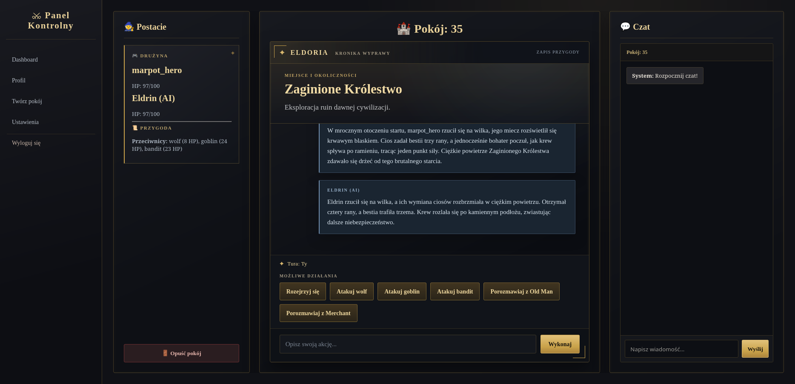
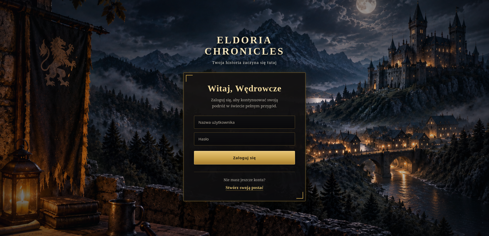
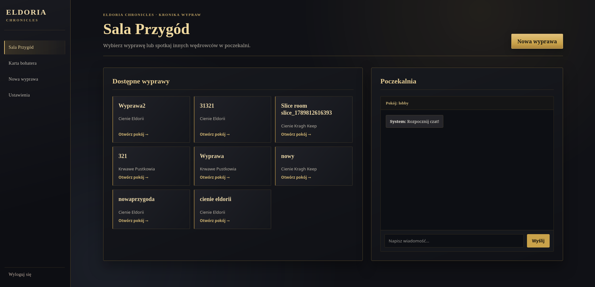
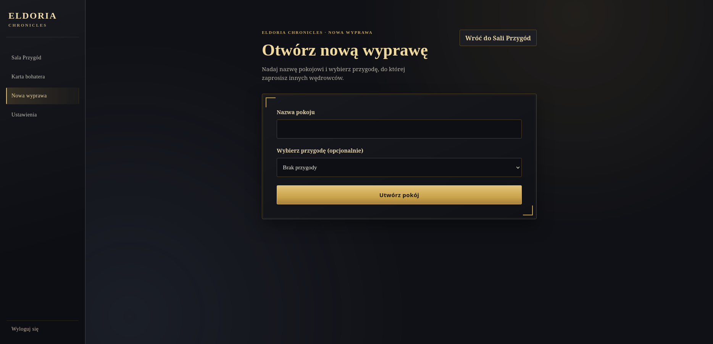
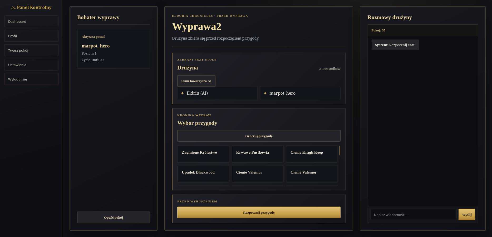
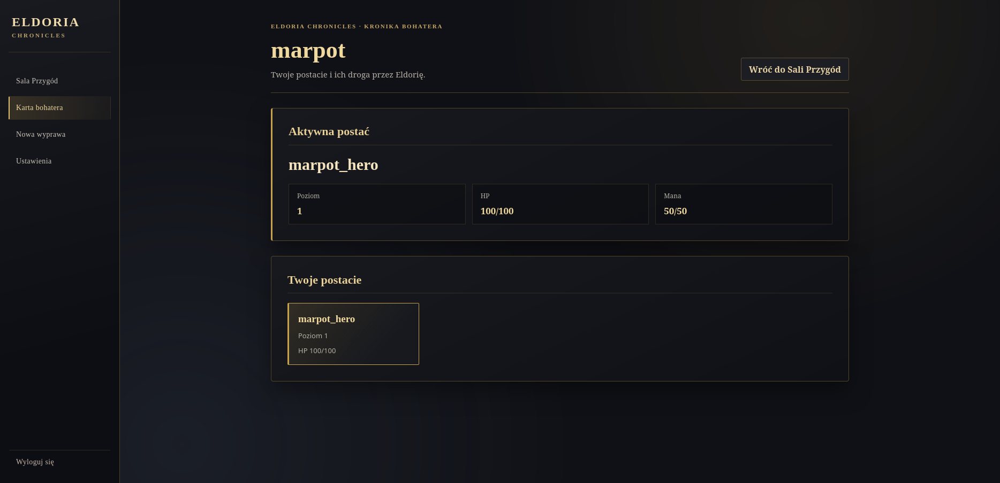

# Eldoria Chronicles

### Full-stack, real-time multiplayer RPG platform

[](https://github.com/marpot/django_react_fullstack_rpg_game/actions/workflows/backend-ci.yml)
[](https://github.com/marpot/django_react_fullstack_rpg_game/actions/workflows/frontend-ci.yml)


Eldoria Chronicles is a portfolio project focused on the engineering behind an online RPG: authenticated game rooms, synchronized multiplayer state, turn-based gameplay, WebSocket communication and AI-assisted adventures. The application combines a polished dark-fantasy React interface with a modular Django game engine.



## What the project demonstrates

- A complete flow from registration and character selection to creating a room, assembling a party and playing an adventure.
- Real-time room chat and gameplay events delivered through Django Channels and Redis.
- A server-authoritative, turn-based game loop with reconnect handling, player presence and deterministic AI companion turns.
- A modular action pipeline for movement, inspection, combat and NPC interaction.
- Runtime room state separated from Django ORM persistence, with explicit entity resolution and state synchronization.
- LLM integrations for validated adventure generation, natural-language intent parsing, narration and NPC dialogue.
- Provider abstraction for Groq, OpenRouter and local Ollama models, plus deterministic fallbacks for core gameplay.
- Automated backend and frontend coverage, an end-to-end gameplay smoke test and GitHub Actions CI.
- Separate development and production Docker Compose configurations, health checks and production security settings.

## Product walkthrough

| Sign in | Adventure dashboard |
| --- | --- |
|  |  |

| Create an expedition | Prepare the party |
| --- | --- |
|  |  |

| Character sheet | Live gameplay |
| --- | --- |
|  |  |

The interface is currently localized in Polish.

## Architecture

```text
React + TypeScript client
        │
        ├── REST API + JWT ───────────────┐
        │                                  │
        └── WebSockets + JWT               ▼
                                  Django + DRF + Channels
                                           │
                      ┌────────────────────┼────────────────────┐
                      ▼                    ▼                    ▼
                 PostgreSQL          Redis channel layer   Runtime game engine
                                                                  │
                                             ┌────────────────────┼──────────────┐
                                             ▼                    ▼              ▼
                                       State manager       Action processor   AI game master
                                             │                    │              │
                                             └──── entity resolution ─── LLM providers
```

### Runtime game engine

Gameplay is processed against isolated, in-memory state for each active room instead of mutating database models directly. `GameStateManager` owns the room state, `EntityResolver` maps runtime objects to persistent entities, and `ActionProcessor` dispatches typed commands to focused action handlers. This keeps combat rules, turn progression and persistence boundaries testable.

The server owns turn order and canonical state. It tracks connected participants, skips disconnected players, advances deterministic bot turns and sends a complete state snapshot when a player reconnects.

### AI layer

The LLM layer is deliberately kept outside the source of truth for game rules. It can:

- turn free-form player text into a constrained `GameCommand`;
- generate narration from an already resolved result;
- create NPC dialogue from game context;
- generate an adventure that is parsed into a typed schema and validated before persistence.

Core actions still have deterministic behavior and narration fallbacks, so game mechanics remain controlled by the backend rather than by model output.

## Core gameplay flow

1. The player authenticates with JWT and selects an active character.
2. The host creates a room, chooses or generates an adventure and can add an AI companion.
3. Django creates the runtime room state and broadcasts the canonical game snapshot.
4. The active participant submits a structured choice or a natural-language action over WebSocket.
5. The action processor resolves entities, applies game rules and produces an event.
6. Updated game and turn state is broadcast to every connected client.
7. The next human or AI turn begins; reconnecting players receive the current state.

## Tech stack

| Area | Technology |
| --- | --- |
| Backend | Python, Django 5, Django REST Framework, Django Channels, Daphne |
| Frontend | React 18, TypeScript, Webpack, Sass, Axios |
| Data and realtime | PostgreSQL, Redis, WebSockets |
| Authentication | Simple JWT for REST and WebSocket connections |
| AI | Groq, OpenRouter or Ollama through a shared provider interface |
| Background work | Celery and Celery Beat (optional `full` profile) |
| Testing | Pytest, pytest-django, pytest-asyncio, Jest, Playwright |
| Delivery | Docker, Docker Compose, Nginx, GitHub Actions |

## Local setup

### Prerequisites

- Docker with Docker Compose
- Node.js and npm
- An optional LLM provider key, or a local Ollama-compatible endpoint

### 1. Configure and start the backend stack

```bash
cp .env.example .env.docker
make bootstrap
```

This builds and starts PostgreSQL, Redis and the Django/Daphne backend. Migrations and static-file collection run automatically. The API is available at `http://localhost:8001`.

### 2. Start the frontend

```bash
make frontend-install
make frontend
```

Open `http://localhost:3000` in a browser.

For development without an external AI API, set `LLM_PROVIDER=ollama` and provide a local model through `LLM_MODEL`. The supported environment variables are documented in `.env.example`.

### Useful commands

```bash
make up                 # start the existing backend development stack
make up-full            # include Celery worker and scheduler
make test               # backend and frontend test suites
make test-backend       # backend tests only
make test-frontend      # frontend tests only
make logs-backend       # follow Django/Daphne logs
make down               # stop development services
```

## Testing and quality

The backend suite covers the action processor contract, combat, multiplayer synchronization, reconnect identity, turn handling, NPCs, adventure validation and a complete gameplay vertical slice. Frontend tests cover turn-state and gameplay UI behavior, while Playwright provides an end-to-end gameplay smoke test.

GitHub Actions runs Django checks and Pytest for the backend, plus Jest and a production Webpack build for the frontend on pushes and pull requests to `main`.

> This README was prepared from the repository state without executing the application or test suites.

## Production configuration

`docker-compose.prod.yml` builds the React application, serves it through Nginx and runs Django, PostgreSQL and Redis with health checks and restart policies. Copy `.env.prod.example` to `.env.prod`, replace every placeholder and then use:

```bash
make prod-build
make prod-up
```

Production configuration includes explicit allowed hosts/origins, HTTPS redirect support, secure headers and required secret/database credentials. Infrastructure manifests should still be reviewed for the target hosting platform before deployment.

## Project status

The playable MVP is complete. It includes authentication, character profiles, room creation, lobby and room chat, multiplayer presence, reconnect-safe state, turn-based combat and exploration, NPC interaction, deterministic AI companions, generated adventures and a polished responsive UI.

Possible next steps include durable runtime-state recovery across backend restarts, richer character progression and inventory, matchmaking, observability and a hosted demo environment.

## Author

**Marcin Potoczny** — [GitHub](https://github.com/marpot)
